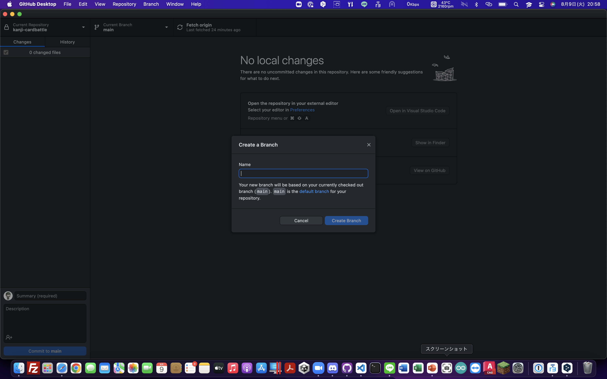
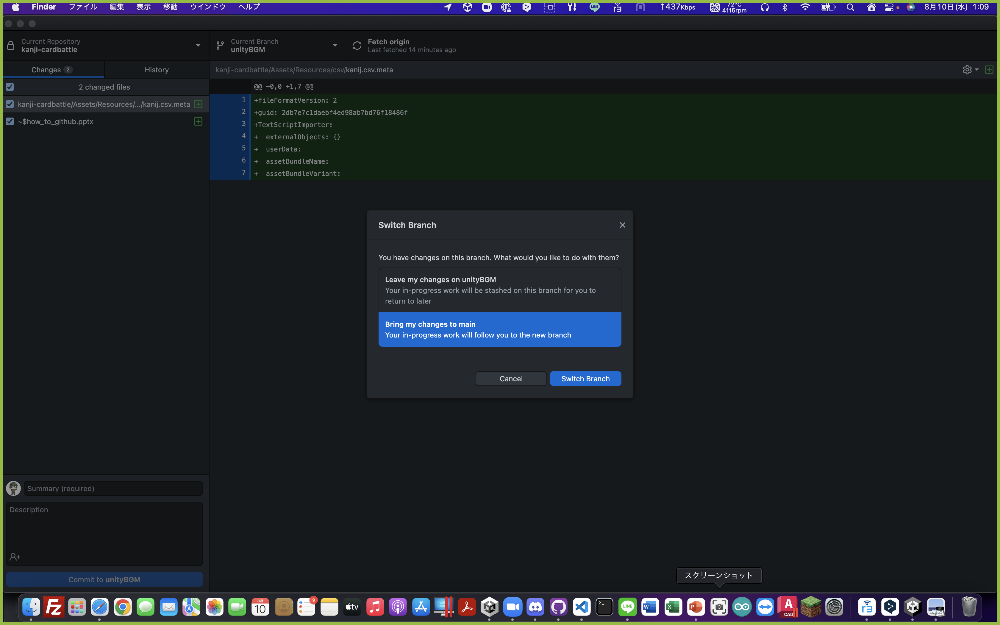
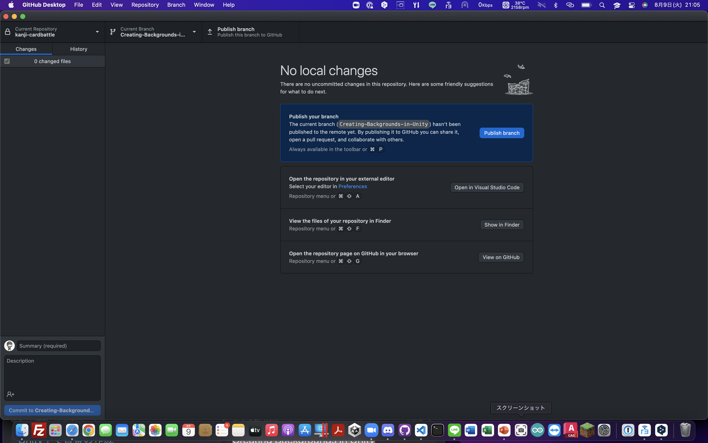
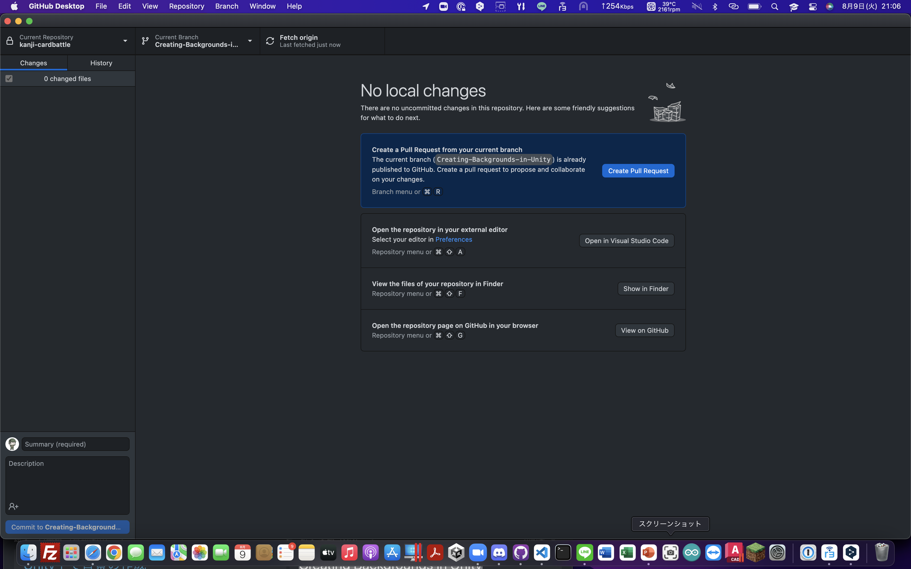

[[PDF版をダウンロード](how_to_github.pdf)]

ブランチとは？

ブランチ\(branch\)は、 __1つのプロジェクトから分岐させることにより、__

__プロジェクト本体に影響を与えずに開発を行える機能のことを言います。__

ブランチを新しく派生させることを  __ブランチを切る__  と言います。

### 1\.新しく作業を始める時

画面の通り作業してください。オレンジのところをクリックしてください。

画面の通り作業してください。オレンジのところをクリックしてください。

画面の通り作業してください。オレンジのところをクリックしてください。

Nameの所にこれから

始める作業のわかりやすい

名前を入力してください。

例: Creating\-Backgrounds\-in\-Unity

※英数字のみ

画面の通り作業してください。オレンジのところをクリックしてください。

※  この画面が出なかったらこの操作は

しなくていいです。

この画面が出てきたら

Bring my changes to main

を選択してください。

画面の通り作業してください。オレンジのところをクリックしてください。

この章の作業は以上です。お疲れ様でした。

コミットとは？

コミット\(commit\)とは一言で言うと「 __追加・変更したファイルを__  __Git__  __に登録するための操作__ 」です。

### 2\.作業がひと段落ついたら

画面の通り作業してください。オレンジのところをクリックしてください。

Summaryの所に今までの作業の進捗を

書いてください。

例: 半分程度

※日本語もいけます。

画面の通り作業してください。オレンジのところをクリックしてください。

この章の作業は以上です。お疲れ様でした。

作業も中盤に差し掛かりました。

頑張りましょう！！

プルリクエストとは？

__プルリクエストとは__ 、自分の変更したコードをリポジトリに取り込んでもらえるよう依頼する機能のことです。

### 3\.作業が完了したら

画面の通り作業してください。オレンジのところをクリックしてください。

画面の通り作業してください。オレンジのところをクリックしてください。

ブラウザが起動します。

プルリクエストを作成しましょう。

Titleに自分の作業した内容

を書いてください。

例：Unit内での背景を変更しました。

あとは管理者の連絡を待ちましょう。

プルリクエストを送った後は管理者の承認を待つだけです。

新しい作業を始める時は、新たにmainブランチからブランチを切って1番から同様に作業をしてください。

