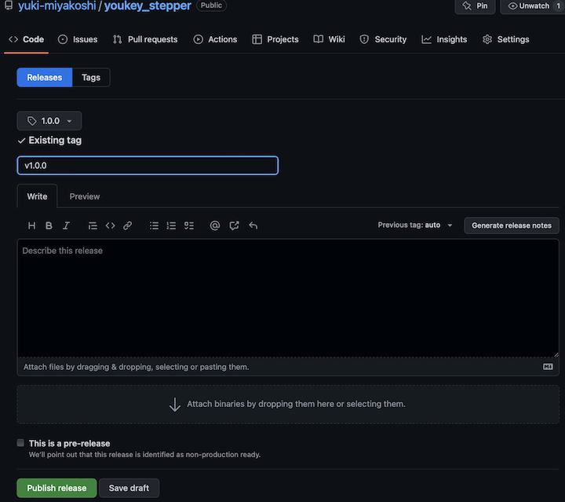
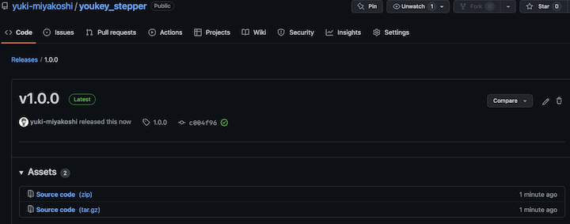
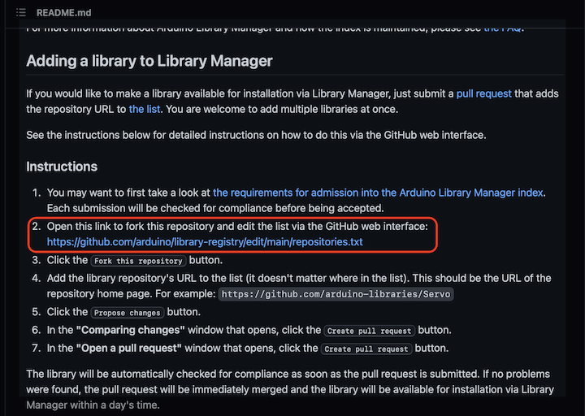
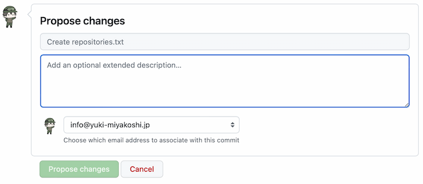
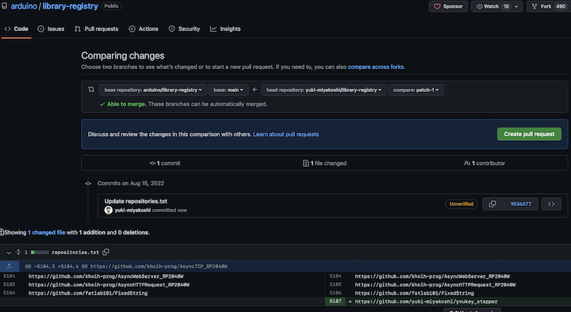
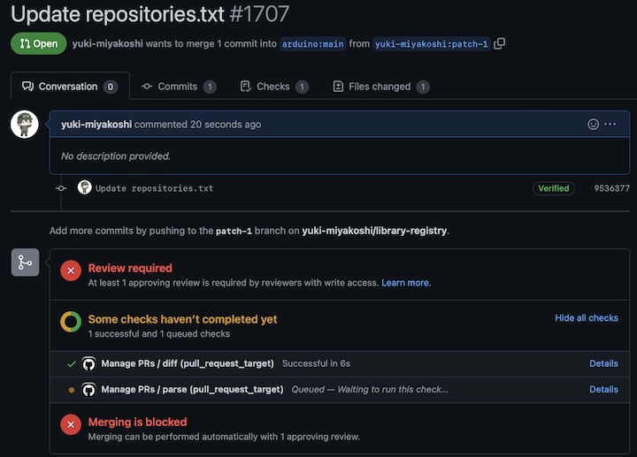
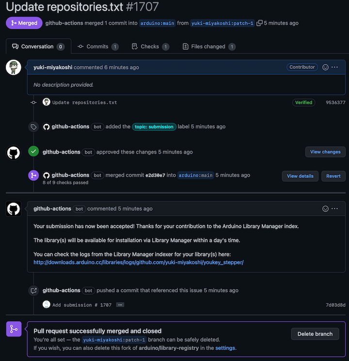

2021年6月以前はArduino公式レポジトリにIssuesで連絡して手動でライブラリマネージャーに登録してもらえるように連絡するという方法でした。

## 前置き

ArduinoというマイコンボードにプログラムするためのソフトであるArduino IDE(統合開発環境)に関するお話です。

Arduino IDEにはライブラリマネージャーという誰か作ったライブラリを簡単に追加できる機能があります。

実は公式以外にも沢山の有志の方のライブラリが登録されています。貴方の作ったライブラリも登録してみませんか？


今回はGitHubの詳しい使い方は省略させていただきます。
また、既に自身の公開レポジトリにプログラムが完成されている前提で話を進めさせていただきます。


## ライブラリの基本的な構成。

以下のような構成になっていると良いと思います。他サイトもこの作業は同じなので省略させていただきます。

```
LICENSE.md		examples		library.properties
README.md		keywords.txt		src

./examples:
stepper

./examples/stepper:
stepper.ino

./src:
youkey_stepper.c	youkey_stepper.h
```

一番重要なのはlibrary.propertiesだと思います。参考までに僕のものを載せておきます。

```:library.properties
name=youkey_stepper
version=1.0.0
author=Yuki MIYAKOSHI
maintainer=Yuki MIYAKOSHI <自身のメールアドレス>
sentence=This is a library dedicated to stepper motors for Arduino and microcontrollers.
paragraph=The excitation system of multiple stepper motors can be easily changed even during operation, and the direction of rotation of each can also be adjusted.
category=Device Control
url=https://github.com/yuki-miyakoshi/youkey_stepper
architectures=*

```

以下の参考サイトに記載の通りに作っていただければ良いと思います。

### 参考サイト
https://arduino.github.io/arduino-cli/0.26/library-specification/

## GitHubでタグを切りましょう。

バージョン命名はセマンティック・バージョニングという命名規則でつけることをおすすめします。今回はv1.0.0でTagを切ります。



`Publish release`を押して以下の画面のようになれば無事成功です。



## Arduino公式レポジトリをForkしましょう。 

以下のサイトで詳しい指示があります。

Instructionsの2番にあるリンクをクリックしてください。

### 参考リンク
https://github.com/arduino/library-registry##readme



以下のような画面になりましたら、Edit fileの中で1番下の行まで移動して自分のレポジトリのURLを書き込んじゃって下さい。

```:私のレポジトリのURL
https://github.com/yuki-miyakoshi/youkey_stepper
```


私の場合は5107行目に書き込んだので5107番目のライブラリということになりそうですね。

では、そのページの一番下、`Propose changes`を押して下さい。(何も説明などは書き込まなくて良いです。)




スクリーンショットを撮り忘れましたが、もしかしたら`Fork this repository`というボタンが出てくるかもしれないので、押して下さい。


## このままプルリクエストを送りましょう。

以下の画面になると思います。この画面で`Create pull request`を押して下さい。



## しばらく待ちましょう。Botが作業中です!

こんな画面に推移すると思います。この画面でしばらく待ちましょう。


５分くらいは少なくてもかかります。気長に待ちましょう。




## この画面が出れば完成です。

以下の画面が出れば無事申請終了です。



## Arduino IDE ライブラリマネージャーで確認してみましょう！

６時間くらい経つとライブラリマネージャーでも検索可能になっていると思います。


作者の名前では検索できないみたいです。ライブラリ名で検索しましょう。


## 終わりに

初めての自分のライブラリを申請してみましたが、思っていたより簡単でしたね。

僕も"使われるライブラリ"を書けるエンジニアになりたいです。

